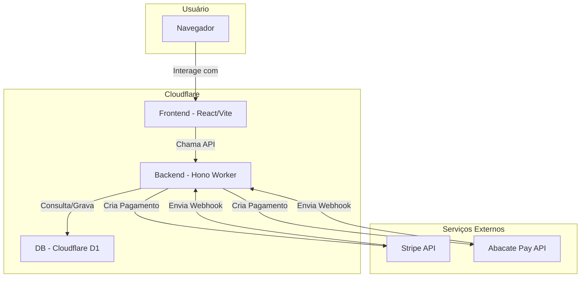

# Documentação do Projeto: Fast Brain Check

Este documento serve como um guia central para a arquitetura, tecnologias e processos do projeto Fast Brain Check.

## 1. Visão Geral da Arquitetura

O projeto utiliza uma arquitetura serverless moderna, com o frontend desacoplado do backend.

- **Frontend:** Uma Single-Page Application (SPA) construída com React e Vite, hospedada no Cloudflare Pages.
- **Backend:** Uma API serverless rodando no Cloudflare Workers, escrita com o framework Hono.
- **Banco de Dados:** Um banco de dados SQL serverless, o Cloudflare D1.
- **Gateways de Pagamento:** Integração com Stripe para pagamentos com cartão de crédito e Abacate Pay para pagamentos via PIX.

### Diagrama de Fluxo



## 2. Stack de Tecnologias

| Categoria | Tecnologia | Propósito |
| :--- | :--- | :--- |
| **Frontend** | React, Vite, TypeScript | Construção da interface de usuário interativa. |
| | Tailwind CSS, shadcn/ui | Estilização e componentes de UI. |
| | `react-router-dom` | Roteamento de páginas no lado do cliente. |
| | `qrcode.react` | Geração de QR Code para pagamentos PIX. |
| **Backend** | Cloudflare Workers | Ambiente de execução serverless. |
| | Hono | Framework para roteamento e middlewares no Worker. |
| | `stripe` (npm) | Biblioteca oficial para interagir com a API do Stripe. |
| **Banco de Dados** | Cloudflare D1 | Armazenamento de dados de produtos e pagamentos. |
| **Pagamentos** | Stripe | Processamento de pagamentos com cartão de crédito. |
| | Abacate Pay | Processamento de pagamentos via PIX. |
| **Tooling** | Wrangler CLI | Ferramenta para desenvolvimento e deploy no Cloudflare. |
| | npm | Gerenciamento de pacotes. |
| **Versionamento** | Git | Controle de versão do código. |

## 3. Estrutura do Projeto

- `src/`: Contém todo o código-fonte do frontend (React).
    - `pages/`: Componentes que representam as páginas da aplicação.
    - `components/`: Componentes reutilizáveis.
    - `services/`: Lógica para fazer chamadas à API do backend.
- `worker/`: Contém o código-fonte do backend (Cloudflare Worker com Hono).
    - `index.ts`: Ponto de entrada da API, define todas as rotas e a lógica de negócio.
- `migrations/`: Arquivos de migração para o banco de dados Cloudflare D1.
    - `0000_create_initial_tables.sql`: Define o schema inicial das tabelas.
- `wrangler.toml`: Arquivo de configuração principal do Cloudflare Worker e D1.
- `.dev.vars`: Arquivo para armazenar variáveis de ambiente locais (NÃO deve ser enviado para o Git).

## 4. Configuração e Variáveis de Ambiente

O arquivo `wrangler.toml` está configurado para conectar o worker ao banco de dados D1. Para o desenvolvimento local, crie um arquivo `.dev.vars` na raiz do projeto com as seguintes variáveis:

```ini
# URL do frontend para CORS e redirects
FRONTEND_URL="http://localhost:5173"

# Chaves do Stripe (use as chaves de teste)
STRIPE_SECRET_KEY="sk_test_..."
STRIPE_WEBHOOK_SECRET="whsec_..."

# Chaves da Abacate Pay
ABACATE_PAY_API_KEY="abacate_live_..."
ABACATE_PAY_WEBHOOK_SECRET="seu_segredo_de_webhook_aqui"
```

**Importante:** As mesmas variáveis precisam ser configuradas como "Secrets" no painel do Cloudflare para o ambiente de produção.

## 5. Fluxo de Pagamento

1.  **Seleção do Produto:** O usuário completa o teste e, na página de dados, escolhe o produto (Relatório Básico ou Completo).
2.  **Criação do Pagamento:**
    - O frontend envia os dados do usuário e o ID do produto para o backend (`/api/create-payment/card` ou `/api/create-payment/pix`).
    - O backend valida o produto no banco de dados D1.
    - Um registro é inserido na tabela `abacate-pay-payments` com status `pending` e um `result_access_token` único.
    - O backend se comunica com o gateway de pagamento (Stripe ou Abacate Pay) para criar a cobrança.
3.  **Processamento do Pagamento:**
    - **Stripe:** O usuário é redirecionado para o Checkout do Stripe.
    - **Abacate Pay:** O frontend exibe o QR Code e o código "copia e cola".
4.  **Confirmação (Webhooks):**
    - Após o pagamento ser confirmado, o gateway envia uma notificação (webhook) para o backend (`/api/webhook/stripe` ou `/api/webhook/abacate`).
    - O backend verifica a assinatura do webhook para garantir a autenticidade.
    - O status do pagamento na tabela `abacate-pay-payments` é atualizado para `approved`.
    - Os dados sensíveis do usuário (CPF, email, WhatsApp) são anonimizados no banco de dados.
5.  **Acesso ao Resultado:**
    - O usuário é redirecionado para a página de sucesso, que faz polling no endpoint `/api/results` usando o `result_access_token`.
    - Assim que o status muda para `approved`, o usuário é levado para a página de resultado final, que busca os dados completos do teste usando o mesmo token.

## 6. Guia de Desenvolvimento Local

1.  **Instalar Dependências:**
    ```bash
    npm install
    ```

2.  **Preparar o Banco de Dados Local:**
    - Aplique as migrações para criar as tabelas no D1 local.
    ```bash
    npx wrangler d1 migrations apply fast-brain-check-db --local
    ```
    - (Opcional) Adicione dados iniciais, como os produtos.
    ```bash
    npx wrangler d1 execute fast-brain-check-db --local --file=./seed.sql
    ```
    *(Nota: O arquivo `seed.sql` precisaria ser criado com os `INSERTs` dos produtos).*

3.  **Iniciar os Servidores:**
    - Em um terminal, inicie o backend (Worker):
    ```bash
    npm run dev:worker
    ```
    - Em outro terminal, inicie o frontend (Vite):
    ```bash
    npm run dev
    ```

4.  **Acessar a Aplicação:**
    - Abra o navegador em `http://localhost:5173`.
